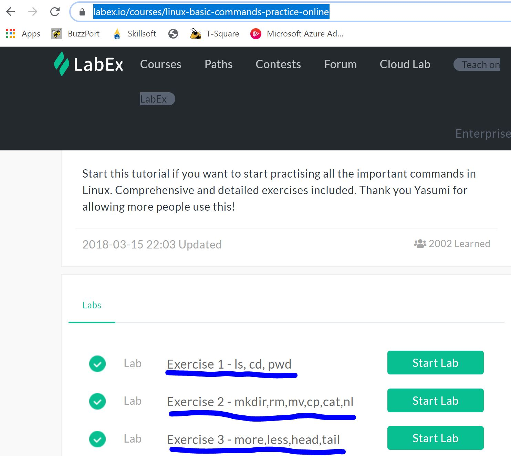
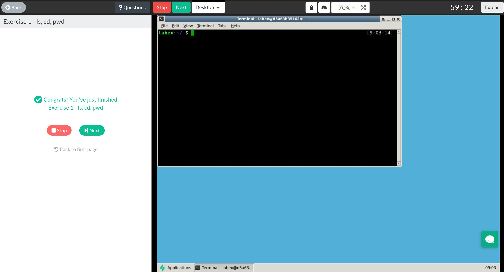
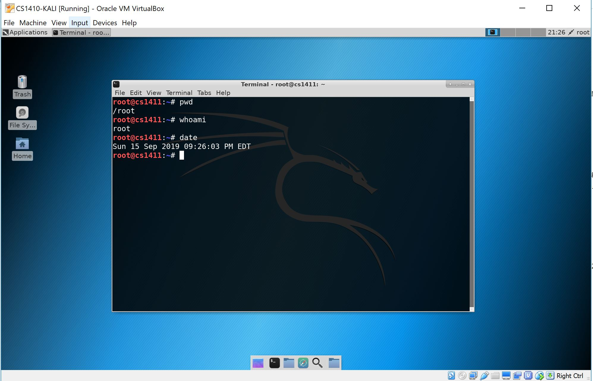

# Assignment 4

**Script Language:** Bash

**VM:** CS1411-Kali

**Goal of assignment:** In this assignment, you will become more familiar with basic Shell commands in Linux.

1. Register for a free account on https://labex.io/

2. Search or go to the Linux basic commands lesson - https://labex.io/courses/linux-basic-commands-practice-online

3. Complete the following exercises 
* Exercise 1 - ls, cd, pwd
* Exercise 2 - mkdir,rm,mv,cp,cat,nl
* Exercise 3 - more,less,head,tail

4. Take a screenshot of the "Congratulations you have completed Exercise X" at the end of each exerise. Snipping Tool or PrintScrn both will work. Save each screenshot with the Exercise Number followed by -<username>. For example, 1-lhundt1234.jpg, 2-lhundt1234.jpg, 3-lhundt1234.jpg. Example screenshot below...

  
5. Lastly, you will need to power on your Kali Linux VM in VirtualBox. Example screenshot below...
- Login to your VM
- Open a terminal window
- Execute the following 3 commands> pwd, whoami, and date
- Take a screenshot of your Kali Linux VM and save as 4-lhundt1234.jpg

**Deliverables:** 3 screenshots of completed Labex.io exercises. 1 screenshot of a running instance of Kali Linux

Points will be deducted for not submitting the assignment correctly. Submissions will only be accepted through D2L. 

Good Luck!
